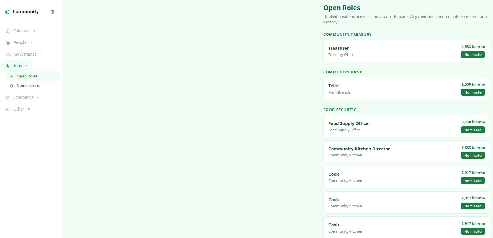

# Benjamin Franklin Society

Software for communities that have decided to build their own institutions.

## The idea

Something has gone wrong with the institutions Americans were supposed to be able to rely on. The details are different depending on who you ask, but the feeling is the same: the systems that were supposed to work for ordinary people mostly don't. Communities can wait for those institutions to fix themselves, or they can start building something they actually control.

A Benjamin Franklin Society is a community that has decided to do the latter: its own governance, its own way for members to look after each other, its own social fabric.

This software is the organizational tool. It gives a community everything it needs to get started: a ledger members use to track exchanges, a market, a mail system, and a shared budget — run by the members, not a corporation or a government. Members extend credit to each other, backed by their commitment to meet each other's needs. The credit supply is anchored to one thing: the number of people in the community. More members, more credit. No interest. No outside lender.

Societies can federate with each other — joining together so that trade can flow across a wider circle. Each society governs itself. A federation only has the authority its member societies choose to give it.

The society is named for Benjamin Franklin, who in 1727 organized the Junto — a club for Philadelphia tradespeople that gave rise to the first public library, the first volunteer fire department, and a hospital. Franklin understood that civic infrastructure doesn't come from governments; it comes from neighbors who decide to build it.

## This is for the United States

The default bylaws, governance structures, and legal assumptions are designed for American communities. That's a deliberate choice — trying to build for every culture at once usually produces something that works well for none of them. The software is open source; communities in other countries are welcome to fork it and adapt it to their own traditions and legal contexts.

## Principles

**Members look after each other — the young, the old, the sick, the person between jobs. That's what a community is.**
An economy that only values people for what they produce has already failed most of them.

**An organization exists to meet people's needs. If it doesn't do that, what's the point.**
Not to grow. Not to attract investment. Not to balance a budget. The only measure that matters is whether people are fed, housed, cared for, and able to live with dignity. Everything else is bookkeeping.

## Inspirations

**Benjamin Franklin's Junto (1727)** — A club for Philadelphia tradespeople that ran for 38 years and seeded nearly every major civic institution Franklin is credited with founding. Members pooled books, shared knowledge, and worked on civic problems together. Small, committed, local — with a clear enough character that it attracted the right people.

**The grange movement** — Farmers' organizations founded in the 1860s that ran co-ops, mutual insurance, and political advocacy for rural communities. At their peak, the granges were the main civic institution in much of rural America. They worked because membership was real: you showed up, you had responsibilities, and the organization was accountable to you.

**Credit unions** — Member-owned financial cooperatives, founded on the principle that people should be able to borrow from each other rather than from a bank. Still operating in nearly every county in America.

**Great Depression-era fraternal lodges** — Community organizations that ran their own insurance, healthcare, and unemployment support through member dues and solidarity. They collapsed not from failure but because the New Deal nationalized their function.

**Argentinian creditos** — When the peso collapsed in 2001 and the government froze bank accounts, millions of Argentinians turned to community exchange clubs that issued their own scrip, backed by the labor and goods members brought to market. At the peak, an estimated six million people were participating. It worked because it was simple, local, and trusted.

**M-Pesa** — Mobile money in Kenya, built on the insight that most people don't need a bank — they need a way to store and send value using the device they already have. It worked because it met people where they were, required no existing financial infrastructure, and spread through social trust networks.

## What's in the repo

- `packages/community` — the core community node: bank, market, mail, census, governance
- `packages/federation` — federates communities; runs a clearing house for inter-community trade
- `packages/commonwealth` — federates federations
- `packages/globe` — the top-level network layer
- `packages/bank` — the underlying account ledger, shared by all layers
- `packages/mail` — inter-node messaging
- `packages/market` — goods and labour exchange
- `packages/core` — shared identity, cryptography, and networking primitives

## Documentation

- [Organizing a community](docs/organizing-a-community.md)
- [Architecture](architecture.md)
